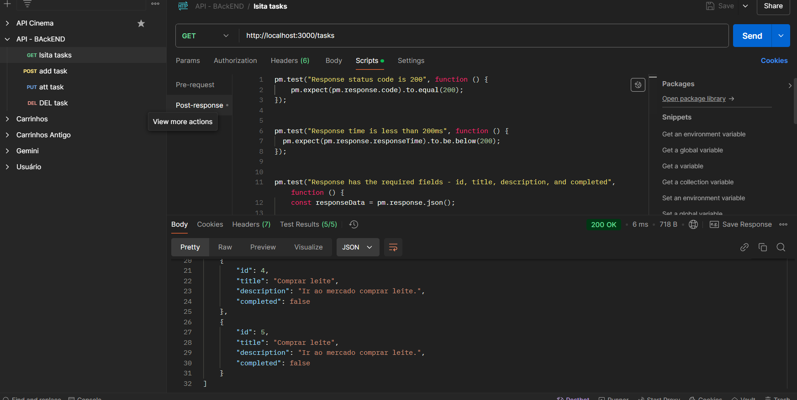
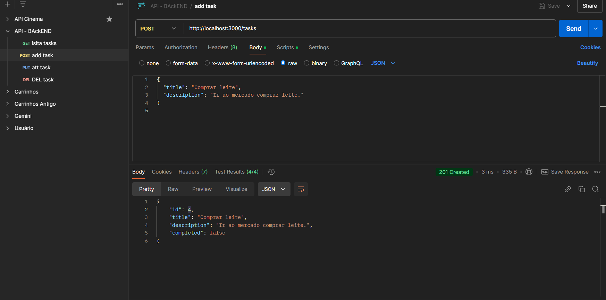
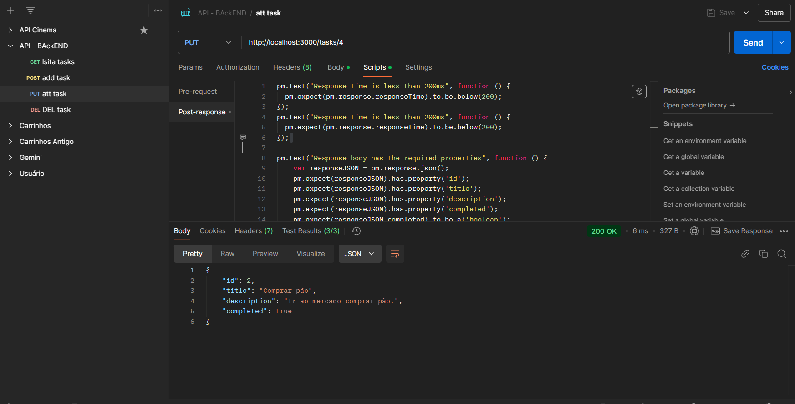
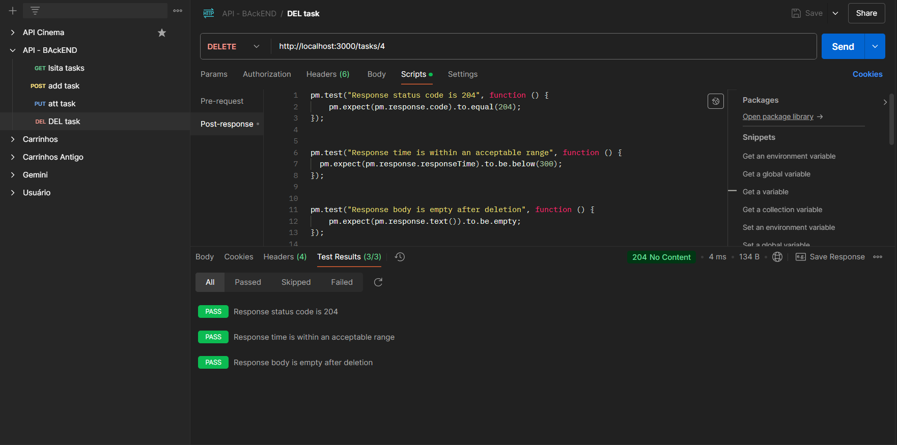

# Task API - Gerenciamento de Tarefas

Esta é uma aplicação simples de gerenciamento de tarefas construída com Node.js e Express. A API permite realizar as operações básicas de CRUD (Criar, Ler, Atualizar e Excluir) para gerenciar tarefas.

## Funcionalidades

A API oferece os seguintes endpoints:

- **GET /tasks**: Retorna todas as tarefas.
- **POST /tasks**: Cria uma nova tarefa.
- **PUT /tasks/:id**: Atualiza uma tarefa existente.
- **DELETE /tasks/:id**: Exclui uma tarefa.

Cada tarefa tem a seguinte estrutura de dados:

```json
{
  "id": number,
  "title": string,
  "description": string,
  "completed": boolean
}
```

## Pré-requisitos

- **Node.js**: Certifique-se de ter o [Node.js](https://nodejs.org/) instalado na sua máquina.
- **npm**: O Node Package Manager (npm) será usado para instalar as dependências do projeto.

## Instalação

1. Clone este repositório ou baixe o código-fonte.

2. Navegue até o diretório do projeto no terminal:

   ```bash
   cd task-api
   ```

3. Instale as dependências do projeto:

   ```bash
   npm install
   ```

## Executando a aplicação

1. Inicie o servidor:

   ```bash
   node index.js
   ```

2. O servidor estará rodando em `http://localhost:3000`.

## Testando os Endpoints

Você pode testar os endpoints da API utilizando ferramentas como **Postman** ou **Insomnia**.

### Endpoints

#### 1. **GET /tasks**
   - **Descrição**: Retorna todas as tarefas cadastradas.
   - **Exemplo de resposta**:

   ```json
   [
     {
       "id": 1,
       "title": "Comprar leite",
       "description": "Ir ao mercado comprar leite.",
       "completed": false
     },
     {
       "id": 2,
       "title": "Lavar a roupa",
       "description": "Lavar todas as roupas sujas.",
       "completed": false
     }
   ]
   ```

#### 2. **POST /tasks**
   - **Descrição**: Cria uma nova tarefa.
   - **Exemplo de corpo da requisição**:

   ```json
   {
     "title": "Comprar pão",
     "description": "Ir ao mercado comprar pão."
   }
   ```

   - **Resposta**:

   ```json
   {
     "id": 3,
     "title": "Comprar pão",
     "description": "Ir ao mercado comprar pão.",
     "completed": false
   }
   ```

#### 3. **PUT /tasks/:id**
   - **Descrição**: Atualiza uma tarefa existente.
   - **Exemplo de corpo da requisição**:

   ```json
   {
     "title": "Comprar pão integral",
     "description": "Ir ao mercado comprar pão integral.",
     "completed": true
   }
   ```

   - **Resposta**:

   ```json
   {
     "id": 3,
     "title": "Comprar pão integral",
     "description": "Ir ao mercado comprar pão integral.",
     "completed": true
   }
   ```

#### 4. **DELETE /tasks/:id**
   - **Descrição**: Exclui uma tarefa com o ID fornecido.
   - **Resposta**: Sem conteúdo, apenas retorna o status `204 No Content`.

### Testes POSTMAN

[Relatório dos testes](/API%20-%20BAckEND.postman_test_run.json)









